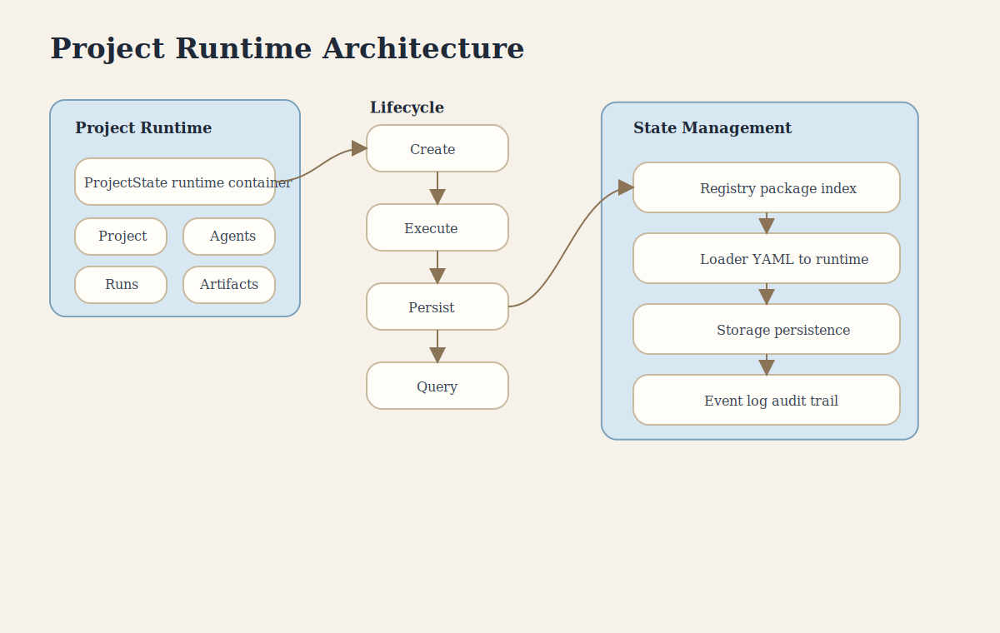

# Project Runtime Architecture

This poster explains how a project moves from loaded package definitions into runtime state, persistence, and audit history.

## Covers

- Project runtime state
- Lifecycle transitions
- Package loading and persistence support
- Event logging and audit history

## Key Concepts

- **ProjectState** is the runtime container around a project definition.
- **Registry** handles package discovery and indexing.
- **Loader** transforms YAML packages into runtime objects.
- **Storage** persists project state and history.
- **Event Log** captures a durable audit trail.
