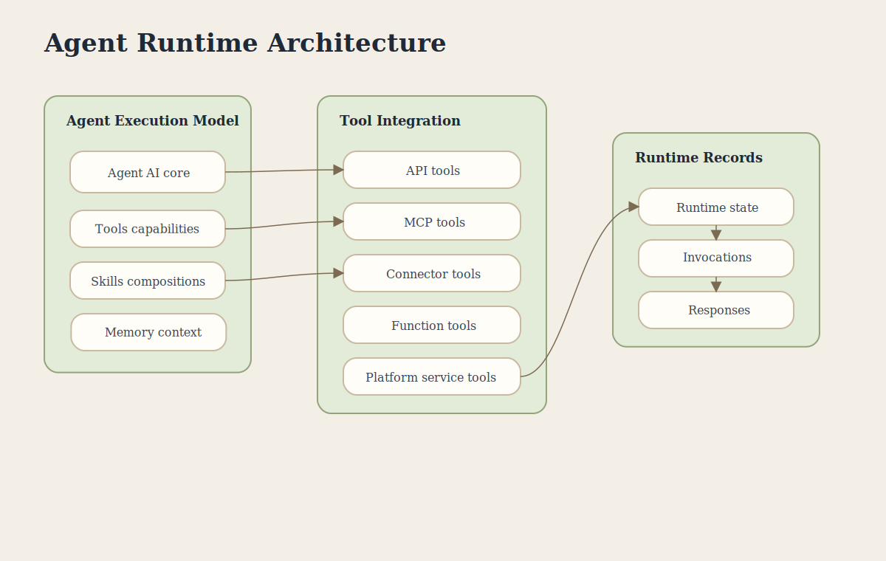

# Agent Runtime Architecture

This poster explains how agents combine instructions, channels, connectors, tools, skills, and runtime state during execution.

## Covers

- Agent execution model
- Inbound and outbound boundaries
- Tool integration
- Skill composition
- Agent runtime records

## Key Concepts

- **Agent** is the AI core with model, instructions, and role.
- **Channels** are inbound communication surfaces.
- **Connectors** are outbound system bindings.
- **Tools** expose discrete capabilities through those bindings.
- **Skills** compose reusable know-how.
- **AgentInstance** represents runtime execution state.
- **Invocations** and responses are tracked as part of execution history.
