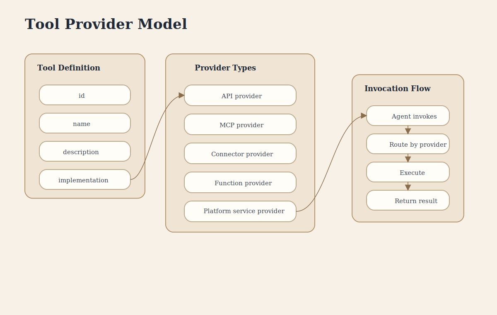

# Tool Provider Model

This poster explains how connectors and tools stay separate: connectors bind external systems, while tools stay uniform at the agent layer and route to different implementation providers.

## Covers

- Tool definition shape
- Connector boundary
- Provider types
- Invocation routing
- Provider abstraction

## Key Concepts

- **Connectors** hold auth, routing, and external system binding.
- **Tools** are the specific actions or retrieval operations the AI can call.
- **5 Provider Types** back tools with different implementations.
- **Tool Providers** expose a consistent interface to agents.
- **Routing** sends invocation requests to the correct provider.
- **Abstraction** keeps provider details out of agent instructions.
- **Extensibility** allows new provider types without changing agent code.
