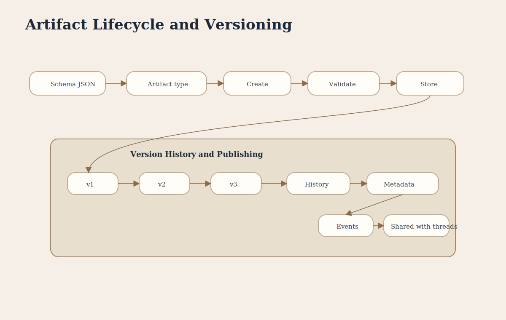

# Artifact Lifecycle and Versioning

This poster explains how artifact definitions become created, versioned, and shared outcomes.

## Covers

- Artifact definition
- Creation flow
- Version history
- Publishing and metadata

## Key Concepts

- **Schema** defines artifact structure.
- **Versioning** preserves full history instead of overwriting.
- **Metadata** records editors, timestamps, and related context.
- **Events** record all modifications.
- **Publishing** makes artifacts available to threads and collaborators.
