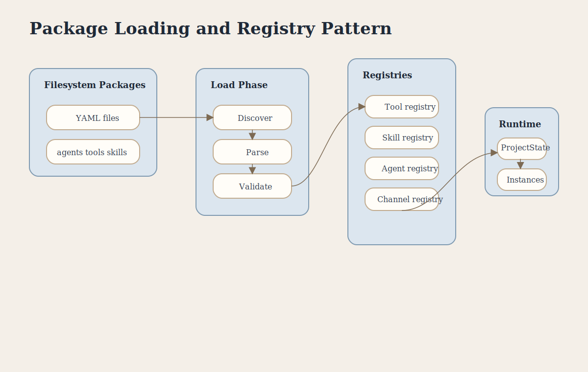

# Package Loading and Registry Pattern

This poster explains how filesystem-first YAML packages are discovered, validated, indexed, and turned into runtime objects.

## Covers

- Filesystem package layout
- Discovery and parsing
- Validation
- Registry construction
- Runtime instantiation

## Key Concepts

- **Package-First** means YAML files are the source of truth.
- **Discovery** finds project package files automatically.
- **Parsing** transforms YAML into structured objects.
- **Registry** indexes packages by ID and kind.
- **Runtime** uses resolved packages to create executable state.
