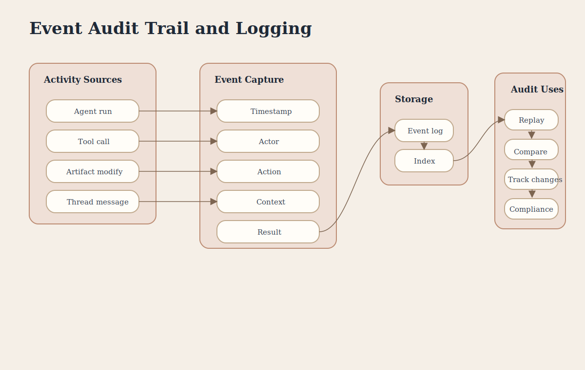

# Event Audit Trail and Logging

This poster explains how the platform records execution activity into a durable, queryable audit history.

## Covers

- Activity sources
- Event capture structure
- Event storage
- Audit and compliance features

## Key Concepts

- **Complete Audit Trail** means every important action is recorded.
- **Event Structure** includes timestamp, actor, action, context, and result.
- **Immutable History** preserves append-only event records.
- **Queryable Storage** supports time-, actor-, and type-based analysis.
- **Compliance** is supported through durable audit records.
